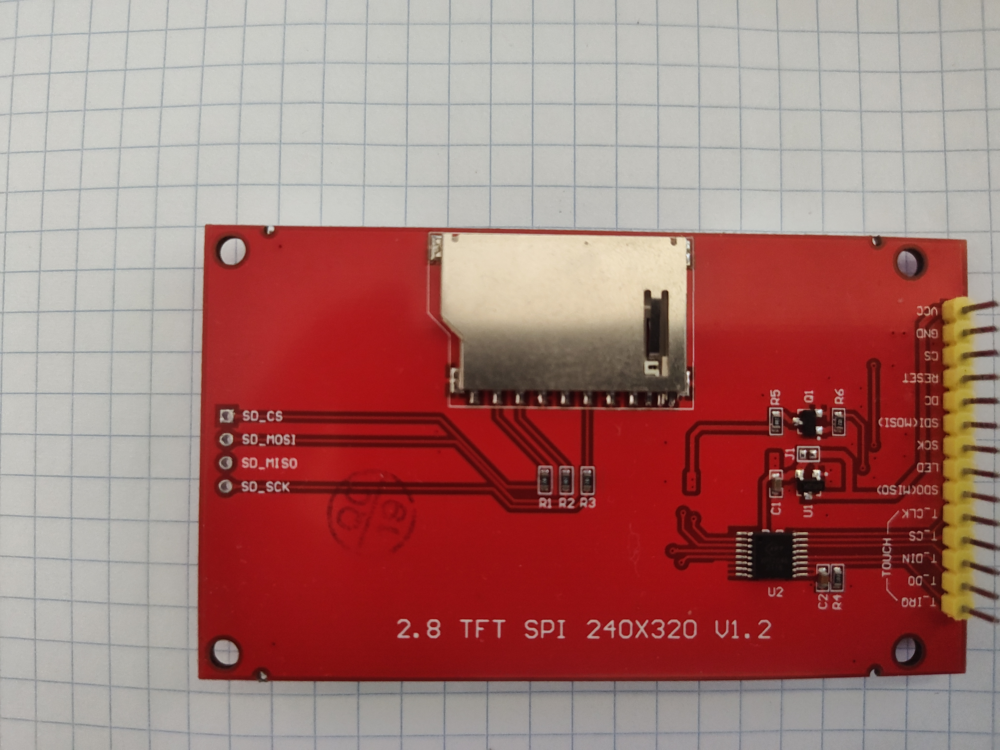
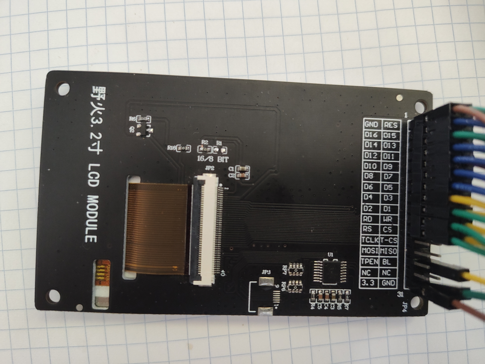
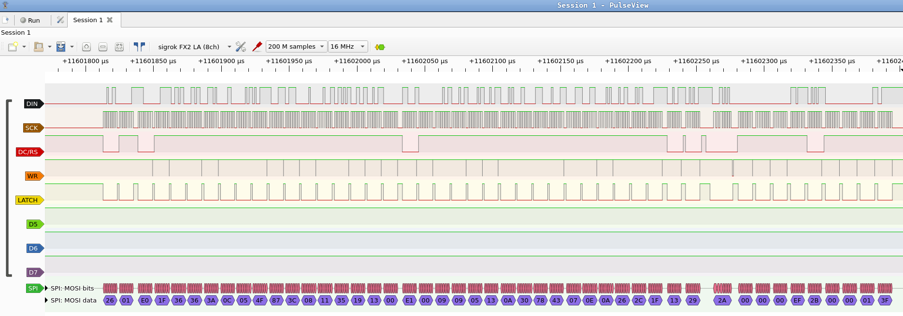
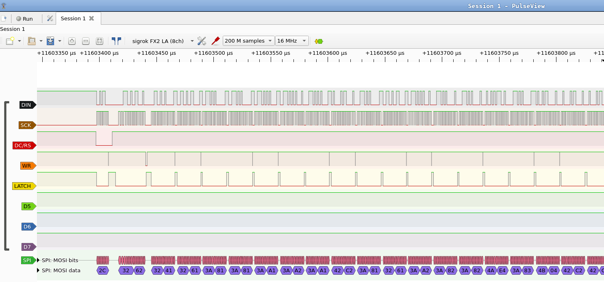
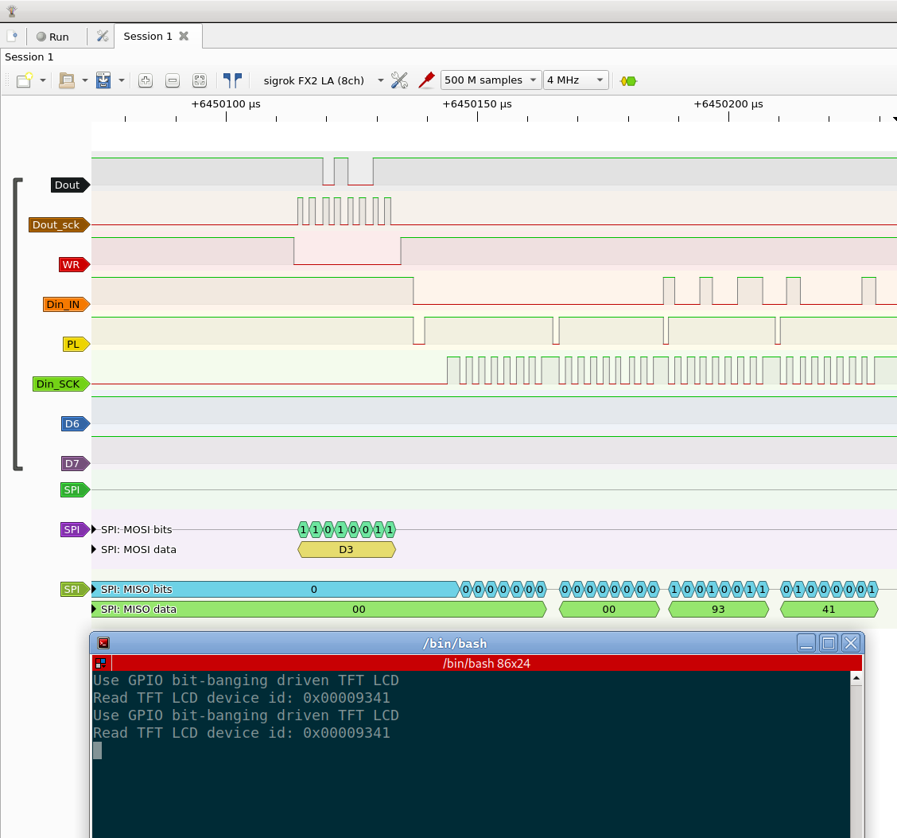

# RP2040-LCD example of Pico-examples  revisited.

## Taken from the Pico-examples, and expanded

* RP2040 with two 74HC595 `daisy-chained` to drive TFT LCD of 8080 MCU 16-bit bus interface, which can save a lot of pins.
* The 74HC595 is an 8-bit serial-in, serial or parallel-out shift register with output latches. The have 100 MHz (typical) shift out frequency.

Expanded with:
* Two shift register 74HC595 daisy chained together to save many pins, which is main purpose of this project.
* Simultaneously drive two LCDs with different interfaces.
* Use 74HC165 (PISO) to read from LCD.
* Also supports GPIO shift of bit-banging method output to drive LCD.

## Supported and tested TFT screens





## Logic probe timing diagram

* LCD control command


* Pixels data of BGR565  after `0x2C`.


## Circuit Diagram Table


|    RP2040  | 74HC565N(1) | 74HC565N(2) |3.2 inch 16bit|2.8 inch SPI |
|:----------:|:-----------:|:-----------:|:------------:|:-----------:|
|    GPIO0   |       DS    |             |              |   SDI(MOSI) |
|    GPIO1   |     SHCP    |     SHCP    |              |     SCK     |
|    GPIO2   |             |             |      RS      |     DC      |
|    GPIO3   |             |             |      WR      |             |
|    GPIO4   |             |             |      RESET   |     RESET   |
|    GPIO5   |     STCP    |     STCP    |              |             |
|     VCC    |      VCC    |     VCC     |              |             |
|     VCC    |       MR    |     MR      |              |             |
|     GND    |      GND    |     GND     |      GND     |     GND     |
| GND/GPIO3  |       OE    |     OE      |              |             |
|            |      Q7S    |     DS      |              |             |
|            |       Q0    |             |      D00     |             |
|            |       Q1    |             |      D01     |             |
|            |       Q2    |             |      D02     |             |
|            |       Q3    |             |      D03     |             |
|            |       Q4    |             |      D04     |             |
|            |       Q5    |             |      D05     |             |
|            |       Q6    |             |      D06     |             |
|            |       Q7    |             |      D07     |             |
|            |             |     Q0      |      D08     |             |
|            |             |     Q1      |      D09     |             |
|            |             |     Q2      |      D10     |             |
|            |             |     Q3      |      D11     |             |
|            |             |     Q4      |      D12     |             |
|            |             |     Q5      |      D13     |             |
|            |             |     Q6      |      D14     |             |
|            |             |     Q7      |      D15     |             |
|     VCC    |      VCC    |     VCC     |      VCC     |     VCC     |
|     VCC    |             |             |              |BL(High Act) |
|     VCC    |             |             |      RD      |             |
|     GND    |             |             |      CS      |     CS      |
|     GND    |             |             |BL(Low Active)|             |


# Second Stage, 74HC595 with 74HC165

## SIPO and PISO

* The below tested that 74HC595 with 74HC165 direct communication,  send data to 74HC595 and read same data from 74HC165.

```sh
static inline uint8_t lcd_74hcxxx_test(uint8_t data) {
    uint8_t bitOrder = MSBFIRST;
    uint8_t value = 0;
    uint8_t i;

    gpio_put(PIN_LATCH, 0);
    for (i = 0; i < 8; ++i) {
        if (bitOrder == MSBFIRST) {
            gpio_put(PIN_DOUT, (data & (1 << (7 - i))) >> (7 - i));
        } else {
            gpio_put(PIN_DOUT, (data & (1 << i)) >> i);
        }
        gpio_put(PIN_CLK, 1);
        gpio_put(PIN_CLK, 0);
    }
    gpio_put(PIN_LATCH, 1);
    gpio_put(PIN_PL, 0);
    sleep_us(1);
    gpio_put(PIN_PL, 1);
    sleep_us(1);
    for (i = 0; i < 8; ++i) {
        gpio_put(PIN_CP, 0);
        if (bitOrder == LSBFIRST)
            value |= gpio_get(PIN_DIN) << i;
        else
            value |= gpio_get(PIN_DIN) << (7 - i);
        gpio_put(PIN_CP, 1);
        sleep_us(1);
    }
    static char text[64];
    sprintf(text, "TEST Read 74hcxxx , 0x%04x\r\n", value);
    uart_puts(UART_ID, text);
    return value;
}
```

## Read ILI9341 device ID

|    RP2040  | 74HC565N(1) | 74HC565N(2) |3.2 inch 16bit|   74HC165D |
|:----------:|:-----------:|:-----------:|:------------:|:-----------:|
|    GPIO0   |       DS    |             |              |             |
|    GPIO1   |     SHCP    |     SHCP    |              |             |
|    GPIO2   |             |             |      RS      |             |
|    GPIO3   |             |             |      WR      |             |
|    GPIO4   |             |             |      RESET   |             |
|    GPIO5   |     STCP    |     STCP    |              |             |
|     VCC    |      VCC    |     VCC     |              |             |
|     VCC    |       MR    |     MR      |              |             |
|     GND    |      GND    |     GND     |      GND     |     GND(08) |
|     GND    |       OE    |     OE      |              |             |
|            |      Q7S    |     DS      |              |             |
|            |       Q0    |             |      D00     |     D00(11) |
|            |       Q1    |             |      D01     |     D01(12) |
|            |       Q2    |             |      D02     |     D02(13) |
|            |       Q3    |             |      D03     |     D03(14) |
|            |       Q4    |             |      D04     |     D04(03) |
|            |       Q5    |             |      D05     |     D05(04) |
|            |       Q6    |             |      D06     |     D06(05) |
|            |       Q7    |             |      D07     |     D07(06) |
|            |             |     Q0      |      D08     |             |
|            |             |     Q1      |      D09     |             |
|            |             |     Q2      |      D10     |             |
|            |             |     Q3      |      D11     |             |
|            |             |     Q4      |      D12     |             |
|            |             |     Q5      |      D13     |             |
|            |             |     Q6      |      D14     |             |
|   GPIO12   |             |             |              |     Q7(09)  |
|   GPIO13   |             |             |      RD      |             |
|   GPIO14   |             |             |              |     CP(02)  |
|   GPIO15   |             |             |              |     PL(01)  |
|     VCC    |      VCC    |     VCC     |      VCC     |     VCC     |
|     GND    |             |             |      CS      |             |
|     GND    |             |             |BL(Low Active)|             |

* 

## Shortcomings

* This project needs addidtional ICs and complex wiring. The 74HC595 and 74HC165 can only work in the bit-banging method with fixed `clock_freq`, also in `shiftout` need an extra instruction to delay, otherwise will show black screen. When tested in the PIO method, the LCD screen is block.I think it may be that the MCU is too fast and produces noise signal interference, Or violates the timing specification. At the moment I don't have enough experience in this area, maybe in the future I'll spend some time making it flexible and robust.